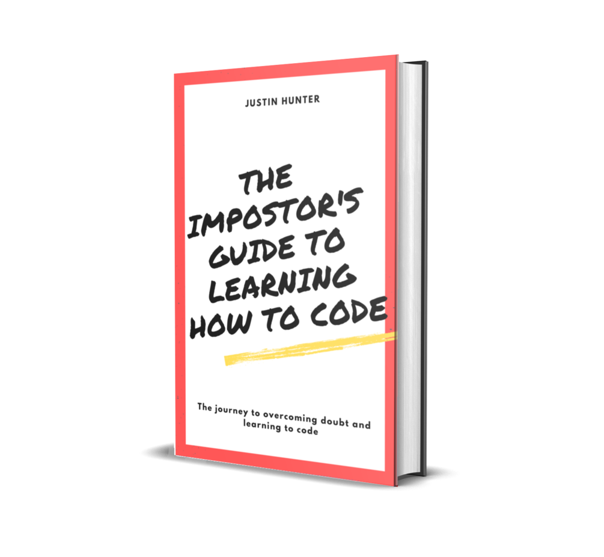
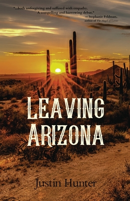

# Books

I write books in addition to writing software and blog posts. My books are listed below.

## The Impostor's Guide To Learning How To Code

My account of overcoming doubt and impostor syndrome while taking the non-traditional path to learning how to code. [Available for pre-order now](https://polluterofminds.gumroad.com/l/YdVtr)!

---

I didn't exactly take the easiest path to learning how to code. Or the quickest. It took me 20 years to finally learn, and when I did, I had to battle impostor syndrome every day.

This book walks through my non-traditional path to learning to code, my struggles with impostor syndrome, staying motivated, and shipping products. My hope is that it will inspire those who are currently going through some of the same struggles I went through.

We live in a time where you don't need a computer science degree to become a professional programmer. All you need is discipline and a little encouragement. The Impostor's Guide To Learning How To Code provides all that and more.

[PRE-ORDER NOW](https://polluterofminds.gumroad.com/l/YdVtr)

I will be releasing drafts of each chapter as I write and asking you all for feedback. You can provide inline comments as well as general feedback on each chapter.

### In Progress Table of Contents

* [Introduction](https://bit.ly/2RWv6NR)
* [On Being An Impostor](https://bit.ly/3wIHwrE)
* [Finding Your Purpose](https://bit.ly/3huw7XI)
* [Learning To Learn](https://bit.ly/2USWayY)
* [The Wall](https://bit.ly/3hTq3Iy)
* [Impostor Syndrome](https://bit.ly/3zukzda)
* [There Is No Right Way](https://bit.ly/3iR988v)

## Leaving Arizona

Buy it on [Amazon](https://www.amazon.com/Leaving-Arizona-Justin-Hunter/dp/1952050022/ref=sr_1_1?dchild=1&keywords=leaving+arizona+justin+hunter&qid=1618147193&sr=8-1), [IndieBound](https://www.indiebound.org/book/9781952050022), or anywhere books are sold.

A collection of short stories featuring characters who are stuck: in reality, in their lives, in bad decisions and the darker sides of life backlit by the unforgiving heat of the desert. The desert can be as cruel as a neglectful parent, an abusive lover, leaving these characters in a drought of love and nourishment. It is the perfect setting for the women, men, children and even the dead who traverse these stories by Justin Hunter, characters gripped in their own struggle, some finding a way to shed their identities like skins, others able to leap through time, but many of them remaining stagnant and unaltered.

> "Justin Hunter’s blistering vision of the southwest and its people—abused, desperate, in love—is both unforgiving and suffused with empathy. A compelling and harrowing debut."
-Stephanie Feldman, author of The Angel of Losses

> “Justin Hunter is the real goddamn deal. Leaving Arizona is one of the best new collections of minimalist fiction I’ve read in years. Like its title, this book is sweltering, and brutal, and a sort of cross-your-fingers hopeful that proves why hope can be as dangerous as despair. Read this book. Follow Justin Hunter. Seriously, do it. Don’t be a fool.”
-Nick Gregorio, author of With a Difference and Good Grief
  